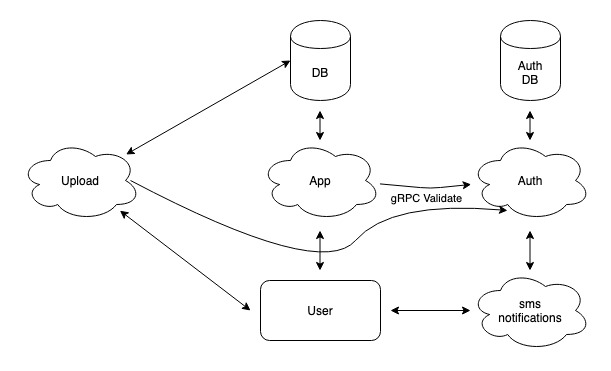

## Online store server backend

Проект представляет собой небольшой сервер на Go для онлайн магазина и на данный момент умеет с помощью предоставленного REST API сохранять, изменять и удалять информацию о товаре, также предоставлять json с информацией об одном товаре по имени, либо всех имеющихся товарах. Во время работы происходит логгирование обрабатываемых запросов и обработки некоторых случаев некорректного использования API.

Также реализован микросервис авторизации, позволяющий пользователю зарегистрироваться и получить доступ к access и refresh токенам для совершения запросов к самому backend'у.

Postman можно найти в папке api.

### Запуск сервера

`sudo docker-compose up --build`

### Api

#### Post запросы

* Создать новый продукт с указанными `name`, `code` и `category`:
`curl -i -X POST "localhost:7171/new-product?name=tomato&code=1000&category=vegetables"`

* Изменить продукт по его `name`:
`curl -i -X POST "localhost:7171/change-product-by-name?old-name=tomato&name=apple&code=7&category=fruits"`

#### Get запросы

* Получить список товаров:
`curl -i -X GET "localhost:7171/product-list"`:

* Получить информацию о товаре по его `name`:
`curl -i -X GET "localhost:7171/product-info?name=apple"`

#### Delete запрос

* Удалить продукт по его `name`:
`curl -i -X DELETE "localhost:7171/delete-product?name=apple"`

